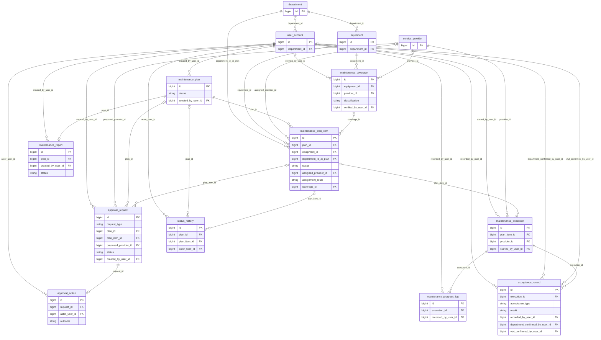
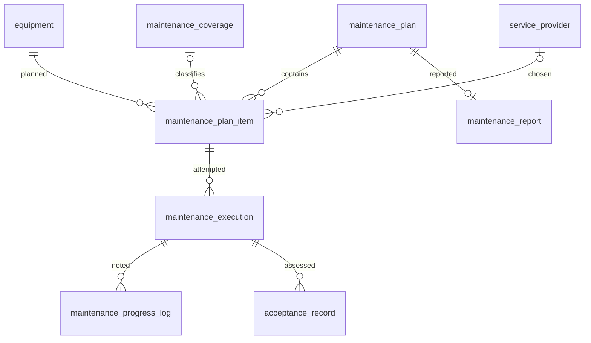
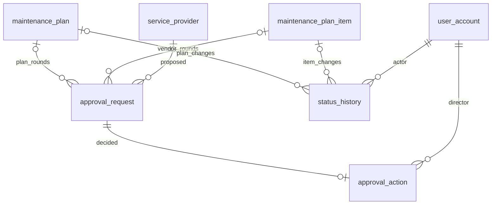

# FINAL FROZEN ERD

## 1. Final Design Scope

Frozen V1: **14 tables, 31 FK relationships, 117 columns**. Maintenance only.

## 2. Final Entity Inventory

| Group | Tables |
| --- | --- |
| Master Data | department, user_account, equipment, service_provider |
| Maintenance Workflow | maintenance_coverage, maintenance_plan, maintenance_plan_item, maintenance_execution, maintenance_progress_log, acceptance_record |
| Approval / Audit | approval_request, approval_action, status_history |
| Reporting | maintenance_report |

## 3. FINAL ERD

All 31 FK relationships are shown. Approval and history have typed nullable targets with exactly-one rules. Known handover signers use explicit user FKs.

## 4. Core Workflow ERD

An item can have multiple work attempts after rework. The report summarizes its plan.

## 5. Approval / Audit ERD

ApprovalRequest holds vendor proposal data directly. ApprovalAction records decisions; StatusHistory records transitions.

## 6. FK Relationship Inventory

| Parent → child | FK | Cardinality | Reason |
| --- | --- | --- | --- |
| department → user_account | department_id | parent 0..N; child 0..1 | scopes account |
| department → equipment | department_id | parent 0..N; child 1 | holds device |
| department → maintenance_plan_item | department_id_at_plan | parent 0..N; child 1 | historical scope |
| user_account → maintenance_coverage | verified_by_user_id | parent 0..N; child 0..1 | verifies coverage |
| user_account → maintenance_plan | created_by_user_id | parent 0..N; child 1 | creates plan |
| user_account → approval_request | created_by_user_id | parent 0..N; child 1 | submits request |
| user_account → approval_action | actor_user_id | parent 0..N; child 1 | makes decision |
| user_account → maintenance_execution | started_by_user_id | parent 0..N; child 1 | records start |
| user_account → maintenance_progress_log | recorded_by_user_id | parent 0..N; child 1 | records work |
| user_account → acceptance_record | recorded_by_user_id | parent 0..N; child 1 | records assessment |
| user_account → acceptance_record | department_confirmed_by_user_id | parent 0..N; child 0..1 | confirms receipt |
| user_account → acceptance_record | vtyt_confirmed_by_user_id | parent 0..N; child 0..1 | confirms handover |
| user_account → maintenance_report | created_by_user_id | parent 0..N; child 1 | authors report |
| user_account → status_history | actor_user_id | parent 0..N; child 1 | causes transition |
| equipment → maintenance_coverage | equipment_id | parent 0..N; child 1 | has evidence |
| equipment → maintenance_plan_item | equipment_id | parent 0..N; child 1 | appears in plan |
| service_provider → maintenance_coverage | provider_id | parent 0..N; child 0..1 | contract partner |
| service_provider → maintenance_plan_item | assigned_provider_id | parent 0..N; child 0..1 | chosen partner |
| service_provider → approval_request | proposed_provider_id | parent 0..N; child 0..1 | proposed partner |
| service_provider → maintenance_execution | provider_id | parent 0..N; child 1 | actual performer |
| maintenance_plan → maintenance_plan_item | plan_id | parent 0..N; child 1 | contains item |
| maintenance_plan → approval_request | plan_id | parent 0..N; child 0..1 | has approval rounds |
| maintenance_plan → maintenance_report | plan_id | parent 0..1; child 1 | has report |
| maintenance_plan → status_history | plan_id | parent 0..N; child 0..1 | has transitions |
| maintenance_plan_item → approval_request | plan_item_id | parent 0..N; child 0..1 | has vendor rounds |
| maintenance_plan_item → maintenance_execution | plan_item_id | parent 0..N; child 1 | has work attempts |
| maintenance_plan_item → status_history | plan_item_id | parent 0..N; child 0..1 | has transitions |
| maintenance_coverage → maintenance_plan_item | coverage_id | parent 0..N; child 0..1 | supports route |
| approval_request → approval_action | request_id | parent 0..1; child 1 | receives decision |
| maintenance_execution → maintenance_progress_log | execution_id | parent 0..N; child 1 | has notes |
| maintenance_execution → acceptance_record | execution_id | parent 0..N; child 1 | has assessments |
