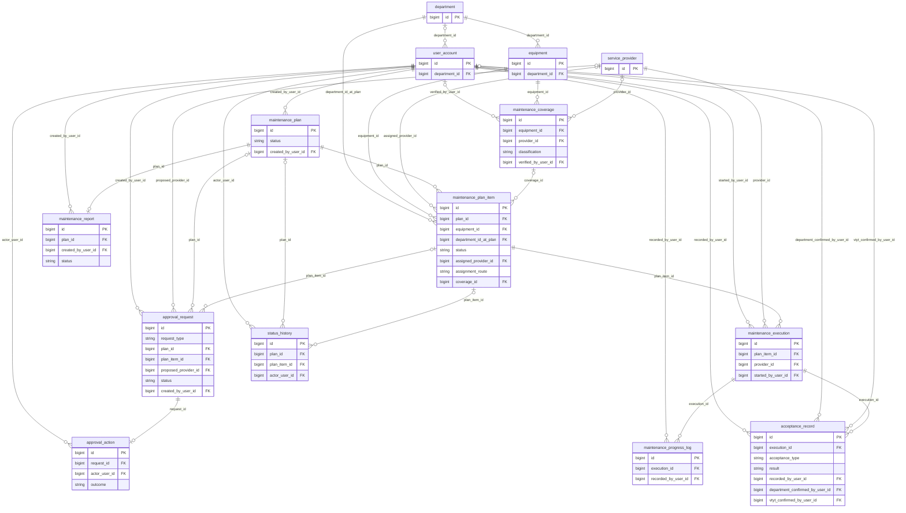
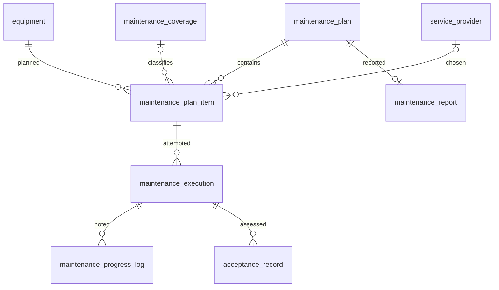
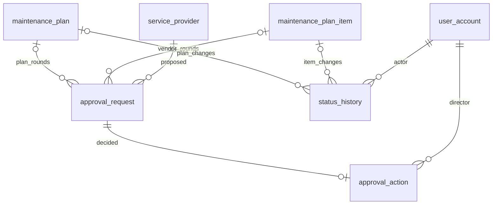

# Phase 1.1 — Final Database Design Freeze

## 1. Objective

The Phase 1.1 model supported the specified workflow but used 20 tables and several mechanisms whose separate lifecycles were not required for a university V1. This freeze re-audited every table, field and relationship against UC01–UC12, BR01–BR05, the two state machines, audit and department scope. The result is the **minimum sufficient normalized model**: clear enough to teach and implement while preserving required history. This is design documentation only.

## 2. Inputs

The primary business source is `docs/system_analysis_v1.pdf` (53 pages: functional analysis, 12 UCs, BR01–BR05, state lifecycle and NFRs). `docs/temple.pdf` (32 PDF pages) supplies BM01/02/03/QT02 and BM06/08/QT01 field evidence; BM09/QT01 helps identify equipment handover terminology. The existing 20-table Phase 1.1 dictionary/ERD/report provided the before baseline. The full QT02 procedure is not included in the forms excerpt; the supplied System Analysis remains the V1 specification. Both PDFs were read only, with unchanged SHA-256 hashes verified in the final audit.

## 3. Design Freeze Principles

Each retained table must support a required UC, BR, state/audit obligation, scope rule, repeating group or source-form concept. The design avoids one-table-per-form copying, speculative repair/contract features, generic RBAC grants, polymorphic attachment infrastructure and redundant snapshots. Where two shapes support the same V1 behavior, the simpler shape is frozen. Source facts are distinguished from **digital workflow design** and **project assumptions** in `design_decisions.md`.

## 4. Before vs After

| Metric | Before | Final | Reduction |
| --- | ---: | ---: | ---: |
| Tables | 20 | **14** | 6 (30.0%) |
| Foreign-key relationships | 42 | **31** | 11 (26.2%) |
| Dictionary columns | 154 | **117** | 37 (24.0%) |

The before counts come from the Phase 1.1 audited dictionary/ERD; final counts are recalculated from the frozen dictionary and ERD. No target count was imposed.

## 5. What Was Simplified

| Previous structure | Frozen representation | Why no required behavior is lost |
| --- | --- | --- |
| `role` + `user_role` | `user_account.role_code` | Four V1 roles; no simultaneous multi-role requirement. |
| `vendor_proposal` | Draft/vendor fields on `approval_request` | UC06 draft, submission and repeated decisions are request rounds; no independent post-decision proposal life. |
| `maintenance_assignment` history | Current provider/route/coverage on `maintenance_plan_item`; actual provider on `maintenance_execution` | UC08 can validate current choice; UC12 can reconstruct performed-provider history. |
| `acceptance_participant` | Explicit department and VTYT signer IDs/times on `acceptance_record` | UC10/BR04 require these two digital confirmations, not arbitrary N witnesses. |
| `attachment` | Deferred optional feature | UC09 says scan upload may be supported; mandatory form information remains in business fields. |
| Multiple label/submission snapshots and SHA-256 | Historical department FK plus execution provider FK | Required scope and performer history survive without speculative exact-payload/cryptographic retention. |

Plan/PlanItem, ApprovalRequest/ApprovalAction, Execution/ProgressLog and StatusHistory remain separate because merging them would erase independent states, decision rounds, repeated work notes or transition audit.

## 6. Final Database Architecture

| Group | Tables | Why this group exists |
| --- | --- | --- |
| Master Data | department, user_account, equipment, service_provider | Stable identity and current catalogue/scope. |
| Maintenance Workflow | maintenance_coverage, maintenance_plan, maintenance_plan_item, maintenance_execution, maintenance_progress_log, acceptance_record | Entitlement, planning, provider choice, repeated work and acceptance. |
| Approval / Audit | approval_request, approval_action, status_history | Submission rounds, director decisions, and immutable state transitions. |
| Reporting | maintenance_report | BM03 narrative after a campaign. |

The model has no V2 repair table, finance contract table, vendor account, or general document store.

## 7. Final Entity Inventory

| Table | Purpose | Main UC |
| --- | --- | --- |
| department | Hospital unit and access scope | UC01, UC10, UC12 |
| user_account | One-role actor, approver, recorder and signer | UC01–UC12 |
| equipment | Current device catalogue and history anchor | UC01, UC12 |
| service_provider | External partner identity | UC05–UC08 |
| maintenance_coverage | Dated verified free/non-free/unknown evidence | UC05 |
| maintenance_plan | Campaign header and eight-state lifecycle | UC01–UC04, UC08, UC11 |
| maintenance_plan_item | One equipment in plan, provider choice and eleven-state lifecycle | UC01–UC12 |
| approval_request | Plan/vendor draft or submitted decision round | UC03/04/06/07 |
| approval_action | Immutable BGĐ decision | UC04/07 |
| maintenance_execution | Work attempt and actual provider | UC08/09/12 |
| maintenance_progress_log | Repeated chronological work/damage notes | UC08/12 |
| acceptance_record | Typed technical/handover result and required signers | UC09/10 |
| maintenance_report | Draft/final narrative report | UC11 |
| status_history | Immutable plan/item transitions | UC01–UC11 |

## 8. Final Overall ERD

The main ERD shows all 14 tables and 31 FKs. It uses only PKs, major FKs and state fields to keep the graph readable. The exact columns and nullability are in `data_dictionary.md`. Typed nullable targets on approval and history have exclusive-target checks.

## 9. Core Workflow ERD

An equipment may recur across plans. A plan item records a current provider route; an execution records the provider actually used in each attempt. Rework creates another attempt and does not erase prior logs or failed assessment. A single plan report summarizes item outcomes.

## 10. Business Forms → Final Tables

| Form | Information groups → final tables | Caution |
| --- | --- | --- |
| BM01/QT02 | period/week/department → maintenance_plan, maintenance_plan_item, department; director review → approval_request/action | Paper grid is department-level; UC01 adds digital equipment items. |
| BM02/QT02 | non-free condition and contract context → maintenance_coverage; proposed partner/grounds → approval_request; director opinion → approval_action | No price/full contract management. |
| BM03/QT02 | work done, achieved/not achieved, causes, next work, resolutions, recommendations → maintenance_report | Generic template; numeric counts derive from items. |
| BM06/QT01 | technical characteristics and conclusion → equipment, acceptance_record | Generic equipment acceptance adapted by UC09. |
| BM08/QT01 | handover parties, department, item and notes → acceptance_record, user_account, maintenance_plan_item | Tool handover adapted by UC10; BM09 is a closer equipment form but not UC10's cited source. |

The forms are evidence of business information, not table blueprints. Repair-only and calibration forms do not generate V1 tables.

## 11. Key Relationships

Plan 1→N item is necessary because a campaign contains independently tracked devices. Equipment 1→N historical items supports UC12, with at most one occurrence inside the same plan. Equipment 1→N coverage preserves dated classifications; missing evidence remains unknown. A plan or item 1→N approval requests supports resubmissions, and each request 0→1 terminal action prevents duplicate decisions. Item 1→N execution and execution 1→N progress log preserve rework chronology. Execution has up to one technical and one handover acceptance per attempt; plan has at most one report. StatusHistory belongs to exactly one plan or item through typed FKs.

## 12. Plan vs PlanItem

A plan is the campaign submitted to BGĐ and later reported. An item is one device within that campaign. SA Part III explicitly gives the plan eight states and the item eleven. One plan can be IN_PROGRESS while one item is COMPLETED and another REWORK_REQUIRED or REPAIR_REQUIRED. A single status column or table would obscure both transition guards and reporting counts. Two current status fields and typed history rows therefore remain mandatory.

## 13. State Persistence

**Plan — 8 values:** DRAFT, SUBMITTED, REVISION_REQUIRED, APPROVED, IN_PROGRESS, AWAITING_REPORT, REPORTED, CLOSED.

**PlanItem — 11 values:** PLANNED, UNDER_CONTRACT, PENDING_PROPOSAL, WAITING_VENDOR_APPROVAL, ASSIGNED_EXTERNAL, IN_MAINTENANCE, AWAITING_TECHNICAL_ACCEPTANCE, AWAITING_HANDOVER, COMPLETED, REWORK_REQUIRED, REPAIR_REQUIRED.

Current state is stored directly on plan/item with distinct constrained string vocabularies and matching application enums. `status_history` stores old/new state, actor, action, time and reason; it never replaces current status. Domain services enforce the transition graph in `logical_data_model.md`. REWORK_REQUIRED loops to another execution attempt. REPAIR_REQUIRED ends V1 maintenance and is a reportable hand-off, not COMPLETED.

## 14. Approval Model

`approval_request` represents one review round. A plan request points to a plan and starts PENDING; a vendor request points to a plan item and may start DRAFT for UC06, with proposed provider, rationale and warranty consideration on the same row. Submission makes it PENDING. BGĐ writes one terminal `approval_action` with APPROVE or REVISION_REQUIRED, actor, time and opinion; the request becomes DECIDED. A revision/resubmission creates a **new** request, leaving prior request/action pairs immutable. A partial uniqueness rule prevents two pending requests for one subject.

The merged vendor proposal does not need its own identity after decision. ApprovalAction remains separate because pending work and the later director decision are different events; this preserves the SA's two concepts and NFR-AUDIT.

## 15. Coverage / Provider Model

`maintenance_coverage.classification` is UNKNOWN, FREE or NOT_FREE. No row and UNKNOWN both block routing; neither becomes NOT_FREE by default. FREE and NOT_FREE require verifier, verification time and basis note. Dated coverage, source contract reference and optional provider remain separate from equipment; V1 does not implement full economic contract management.

For FREE, UC05 records the verified coverage record, provider and UNDER_CONTRACT route on the item. For NOT_FREE, UC06 stores proposed provider and grounds on the VENDOR_SELECTION request; UC07's APPROVE action authorizes the item's EXTERNAL_APPROVED route. UC08 checks plan approval and matching route/evidence before work. `maintenance_execution.provider_id` records who actually performed each attempt.

## 16. Execution Model

One `maintenance_execution` is one work attempt with item, actual provider, attempt number, start/end and result note. Multiple `maintenance_progress_log` rows record steps and damage. If technical or handover assessment fails and item enters REWORK_REQUIRED, a new execution attempt follows when work restarts. This two-table split earns its place: putting only current start/end on the item would overwrite earlier attempts, and putting all progress into one text column would lose chronology. REPAIR_REQUIRED retains damage note, item/equipment link and transition audit without a Repair V2 entity.

## 17. Acceptance / Handover Model

One `acceptance_record` covers either TECHNICAL_ACCEPTANCE (UC09) or HANDOVER_ACCEPTANCE (UC10), with PASS/FAIL, observation time, conclusion and recorder. Technical PASS is required before handover. Handover PASS additionally requires `department_confirmed_by_user_id` and `vtyt_confirmed_by_user_id` plus their times; the department user must be authorized for the item's historical department scope. A failed result remains rather than being overwritten. At most one technical and one handover assessment exist per execution attempt; rework starts another attempt. BM06/BM08 support the conclusion/party vocabulary, while the exact digital signer rule comes from UC10/BR04, not a claim of legal electronic-signature equivalence.

## 18. Audit Model

`approval_action` is the official decision trail; `status_history` is the plan/item state-transition trail. Both are append-only through application workflow. History has typed optional `plan_id` and `plan_item_id`, exactly one present, so PostgreSQL FKs protect referential integrity. An approval action may trigger a state transition, but its decision and the transition row answer different questions. Service transactions commit request/action, current state and history atomically. There is no generic target type/id pointer and no cryptographic submission hash because the SA asks for actor/time/action/history, not proof of exact historical document bytes.

## 19. Normalization

- BM01 repeats months/weeks/departments; `maintenance_plan` + many `maintenance_plan_item` rows avoid grid columns and allow per-equipment history.
- Coverage varies over time and may be unknown. A separate `maintenance_coverage` avoids one ambiguous boolean on equipment and preserves each verified basis.
- Provider contact/name belongs in `service_provider`; requests, items and executions reference it rather than copying provider details into every record.
- ApprovalRequest and ApprovalAction are separate because the decision occurs after submission and may recur across rounds; a single mutable row would overwrite history.
- Repeated work notes and rework attempts need `maintenance_progress_log` and `maintenance_execution`. By contrast, known handover signers are two explicit columns, so an arbitrary participant table would add unnecessary generality.

The retained `department_id_at_plan` is a historical FK, not a copied label. The model avoids uncontrolled snapshot duplication.

## 20. Business Rule Enforcement

| BR | Database support | Backend support |
| --- | --- | --- |
| BR01 | Plan status, item link, optimistic version | Edit only DRAFT/REVISION_REQUIRED; revised save returns to DRAFT; lock other states. |
| BR02 | Plan/item statuses and provider/coverage/request references | Check approved plan and valid route before work; reject pre-approval execution. |
| BR03 | UNKNOWN/FREE/NOT_FREE coverage, item provider/route, request/action | Verify evidence and provider match; no missing-data inference. |
| BR04 | Typed acceptance, signer IDs/times, item state | Current attempt technical PASS then scoped department + VTYT handover PASS before COMPLETED. |
| BR05 | Typed StatusHistory with actor/old/new/time/action | Append exactly one history row per transition in same transaction; prohibit routine edits/deletes. |

DB CHECK/UNIQUE/FK protect local integrity; multi-row temporal and authorization rules belong in domain services. `database_constraints.md` is the exact enforcement catalogue.

## 21. NFR-driven Design

**Department isolation:** account home department, equipment current department and item department-at-plan support scoped UC10/12 queries; services enforce access. **Auditability:** immutable approval actions and transition histories. **Concurrency:** version columns on mutable plan/item reject stale writes. **Atomicity:** decision/acceptance, state and audit commit or roll back together. **Performance:** initial indexes target equipment history, plan counts, pending approvals, audit and work logs; further indexes await the source's 10k-equipment/100k-history/500-item test baselines. **Retention:** submitted records stay; referenced masters deactivate. These are design provisions, not measured deployment claims.

## 22. Traceability

| Business process | UC | Main final tables |
| --- | --- | --- |
| Plan and edit maintenance | UC01/02 | department, equipment, maintenance_plan, maintenance_plan_item, status_history |
| Submit/approve campaign | UC03/04 | maintenance_plan, approval_request, approval_action, status_history |
| Verify coverage and select provider | UC05–07 | maintenance_coverage, service_provider, maintenance_plan_item, approval_request, approval_action |
| Execute and record progress | UC08 | maintenance_execution, maintenance_progress_log, maintenance_plan_item, status_history |
| Technical acceptance and handover | UC09/10 | acceptance_record, maintenance_execution, maintenance_plan_item, status_history |
| Report and equipment history | UC11/12 | maintenance_report, equipment, maintenance_plan_item, maintenance_execution, acceptance_record, status_history |

The reverse matrix in `database_traceability_matrix.md` maps every UC01–UC12 to exact final tables, and each of the 14 tables has a business reason.

## 23. Design Freeze Policies

| FP | Frozen decision | Source/design classification |
| --- | --- | --- |
| FP-01 | DRAFT/REVISION_REQUIRED editable; revised save → DRAFT | Project decision resolving SA conflict |
| FP-02 | New request each plan/vendor resubmission; separate immutable action | Digital workflow, UC03/04/06/07 |
| FP-03 | UNKNOWN/absent blocks; FREE/NOT_FREE verified | UC05/BR03 with minimal encoding |
| FP-04 | Vendor provider/grounds on request, decision on action | BM02 plus digital workflow |
| FP-05 | Explicit execution attempts and repeated logs | UC08/09 state loop |
| FP-06 | One typed acceptance table | UC09/10 digital design |
| FP-07 | Two explicit V1 handover signer pairs | Project assumption from UC10/BR04 |
| FP-08 | REPAIR_REQUIRED reportable V1 hand-off, never COMPLETED | Project policy from lifecycle/UC10/11 |
| FP-09 | Optional attachments deferred | UC09 optional wording; project scope |
| FP-10 | Keep historical department and actual provider FKs; remove speculative snapshots/hash | Project minimum with UC12/NFR |

`design_decisions.md` includes rationale, consequences and superseded Phase 1.1 choices. These policies are **project V1 choices**, not claims that the hospital forms specify every electronic behavior.

## 24. Remaining Non-blocking Questions

The complete QT02 procedure text is absent from the excerpt. BM09 is a closer equipment-handover form than BM08, though UC10 cites BM08. Exact contract evidence for free maintenance, additional paper witnesses, legal signature equivalence, retention duration and later scan-upload preferences may require hospital consultation. The frozen V1 policies handle the supplied UCs without different tables or FKs. If new stakeholder facts expand the scope, Phase 1.2 must stop and request a reviewed design amendment. `open_questions.md` records the details. **Implementation blockers: none for the documented university V1.**

## 25. Implementation Readiness

The frozen `data_dictionary.md` specifies all 117 columns; `erd.md` has all 14 entities and 31 FKs; `database_constraints.md` separates DB and service checks; `phase_1_2_implementation_contract.md` fixes migration order, state storage, indexes, retention and prohibited deviations. UC01–UC12 and BR01–BR05 are covered. Plan and item lifecycles remain exact. No schema-level question remains for the **documented V1 scope**. Phase 1.2 should implement only after human review of this freeze and should report any new source conflict before changing schema.

## 26. FINAL PHASE STATUS

**PASS — design freeze complete for the supplied university V1 specification.** This is a design verdict, not a claim that the hospital has approved electronic policy details. The final consistency audit confirmed table/FK/column counts, dictionary/ERD agreement, UC/BR/state coverage, unchanged source PDFs, and absence of SQL migrations or application code.

