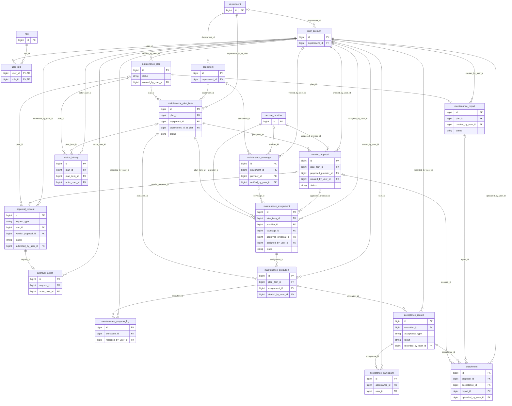
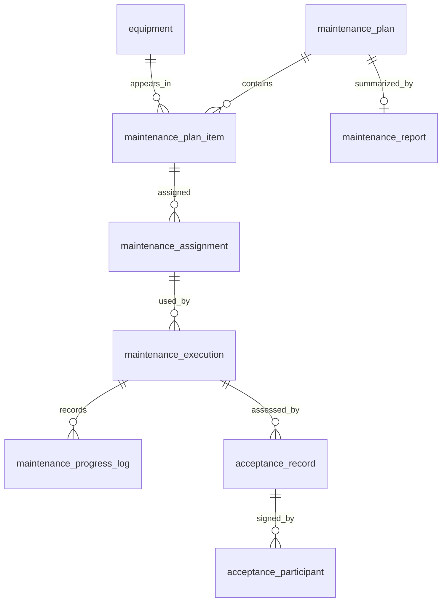
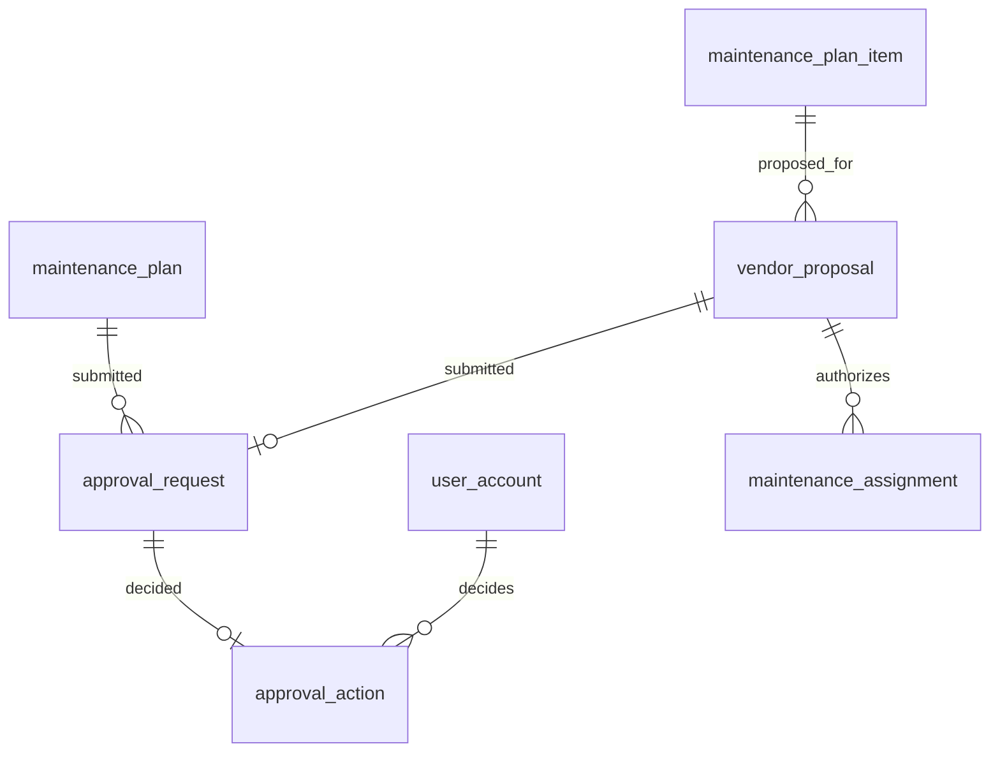
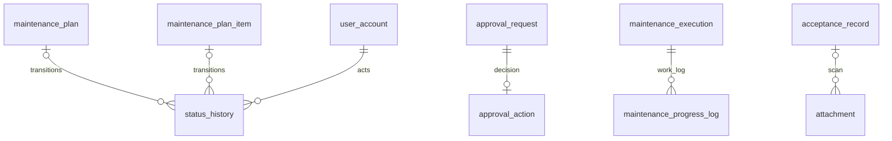

# Phase 1.1 — Database Design Report

> **Historical pre-freeze report.** The final 14-table design and PASS status are in `reports/phase_1_1_database_design_freeze_report.md`; this older report does not control Phase 1.2.

## 1. Executive Summary

Phase 1.1 translates the supplied V1 System Analysis and hospital forms into a design-only relational model for the Medical Equipment Maintenance Management System. It contains **20 proposed tables, 42 foreign-key relationships, eight plan states, eleven item states, five mapped business rules, and storage support for UC01–UC12**. No PostgreSQL schema, SQL migration, seed data or application code was created. The model separates current state from audit history, approval requests from decisions, verified free maintenance from insufficient coverage, and technical acceptance from handover through typed records. Status is **PARTIAL** pending review of source gaps and provisional policies documented below.

## 2. Project Context

V1 follows planning → director approval → provider/coverage decision → execution → technical assessment → department handover → report/history. PHONG_VTYT operates the process, BAN_GIAM_DOC approves, KHOA_PHONG confirms handover and sees scoped history, and ADMIN manages users/catalogues. Vendors do not log in. REPAIR_REQUIRED is a terminal maintenance hand-off to a later V2 repair process; no V1 repair schema is proposed.

## 3. Design Methodology

The derivation is **business process → FR → UC → DR → entity → relationship → attribute → constraint → ERD**. Example: QT02/BM02 provider invitation → FR-ASSIGN-03 → UC06 → DR-PROV-002/DR-APP-001 → vendor_proposal + approval_request → provider and item FKs → rationale, submission evidence → exclusive target and decision constraints. The separate requirement, dictionary, ERD and traceability files expose each step. Paper forms combine repeated equipment and signers with signatures and narrative. Storing each form as one table would make departments, devices and providers repeat, hide temporal decisions, and prevent clean history queries.

## 4. Source Documents

| Source | Role in design | Limitation |
| --- | --- | --- |
| `docs/system_analysis_v1.pdf`, 53 pages | Primary V1 scope, FR, UC, BR, state and NFR source | Contains a BR01 wording conflict; QT02 procedure cited but not attached in full |
| `docs/temple.pdf`, 32 PDF pages (printed pp. 63–94) | Primary form fields/terminology for BM01/02/03/QT02 and BM06/08/QT01 | Includes broader equipment/tool forms, not dedicated maintenance acceptance; BM09 is a closer equipment-handover analogue; BM03 is generic |
| `reports/phase_0_environment_report.md` | PostgreSQL target and environment boundary | No business semantics |

**Source facts** are the dated schedule, departments/equipment, proposed provider and grounds, coverage contract reference, technical notes, participant roles, and report sections. **Digital design** includes surrogate keys, independent states, approval rounds, optimistic version, typed audit references and narrow historical snapshots. The source PDF files were used read only.

## 5. Data Requirements Analysis

| Domain | Representative DR | Storage implication |
| --- | --- | --- |
| Identity/scope | DR-ID-001/002 | user_account, role, user_role, department |
| Equipment/coverage | DR-EQP-001/002, DR-COV-001/002 | equipment and dated, verified maintenance_coverage |
| Planning | DR-PLAN-001/002/003 | plan, item, approval submission snapshot |
| Approval/provider | DR-APP-001/002, DR-PROV-001/002, DR-ASG-001 | proposal, request/action, provider, assignment |
| Execution/acceptance | DR-EXEC-001/002, DR-ACPT-001/002 | work attempts/logs, assessments/participants |
| Reporting/evidence/audit | DR-REP-001/002, DR-ATT-001, DR-AUD-001/002 | one plan report, attachment metadata, append-only history |
| Reliability/retention | DR-NFR-001/002 | version, atomic transition, no routine deletion |

The complete IDs, source/FR/UC/form links and mandatory/optional tags are in `database_design/data_requirements.md`.

## 6. From Forms to Database Model

| Form | Actual information groups → normalized storage | Important caution |
| --- | --- | --- |
| BM01/QT02 | month/week/department schedule → maintenance_plan period and maintenance_plan_item planned date + department; director approval → approval_request/action | The paper grid is department-level and includes repair in its title; item-level equipment is from UC01 digital scope. |
| BM02/QT02 | device and non-free statement → equipment + verified coverage; partner invitation/grounds → vendor_proposal; director opinion → approval_request/action | Price and full contract finance are absent. |
| BM03/QT02 | work done/achieved/not achieved/causes/next work/recommendations → maintenance_report; counts derive from items | Generic blank headings do not prove detailed metrics. |
| BM06/QT01 | technical specifications, conclusion, participants, signatures → equipment, acceptance_record, acceptance_participant, attachment | Generic equipment acceptance; UC09 adapts it to post-maintenance technical assessment. |
| BM08/QT01 | handover parties, receiving department, repeated item rows and notes → acceptance_record/participant, plan_item, attachment | Tool handover source; UC10 adapts it. One scan may cover several items; current attachment ownership may need confirmation for such a scan. |

BM09/QT01 additionally records equipment model, serial, receiving condition, accessories and warranty; it may be more relevant to equipment handover than BM08, but UC10 expressly cites BM08. BM05/QT01 supports a contract/warranty reference but does **not** itself prove free maintenance. Repair-only BM04–BM07/QT02 and calibration forms were inspected as scope exclusions.

## 7. Conceptual Data Model

Master/reference entities identify departments, hospital actors/roles, equipment and providers. Workflow entities record coverage evidence, the plan and its items, proposal/approval rounds, assignments, executions, acceptance and report. Audit/evidence entities preserve approval actions, progress logs, scans and state transitions. The full meaning, source and relationship of every entity is in `database_design/conceptual_data_model.md`.

Plan and item are separate because one campaign can contain equipment at different stages. Coverage is separated from equipment to preserve dated evidence and unknown status. A proposal is separate from a director's action so the suggested provider and its decision cannot be confused. Each execution attempt is separate from progress notes and acceptance attempts, so rework does not overwrite a failed event.

## 8. Entity Inventory

| Category | Tables | Count |
| --- | --- | ---: |
| Master/reference | department, role, user_account, user_role, equipment, service_provider | 6 |
| Workflow/transaction | maintenance_coverage, maintenance_plan, maintenance_plan_item, vendor_proposal, approval_request, maintenance_assignment, maintenance_execution, acceptance_record, acceptance_participant, maintenance_report | 10 |
| Audit/evidence | approval_action, maintenance_progress_log, attachment, status_history | 4 |
| **Total** | | **20** |

Every table's source and purpose appears in `database_design/database_traceability_matrix.md`.

## 9. Relationship and Cardinality Design

A plan has zero-to-many items while DRAFT, **at least one before submission**; an equipment can recur in many plans but only once per plan. One equipment has multiple dated coverage records. One plan can have multiple approval rounds after revisions; each submitted vendor proposal has at most one request, and a revised proposal is a new record. One request receives at most one terminal decision. One item has multiple historical assignments, but one effective assignment; each work attempt cites its assignment. An item can have multiple attempts and logs. Each assessment attempt has repeated participant rows. A plan has at most one report. The 42 FK relationships, both directions of cardinality, optionality, owner and rationale are enumerated in `database_design/conceptual_data_model.md` and `database_design/erd.md`.

## 10. ERD — Overall Model

Read each line as referenced parent → referencing child. Nullable subject/owner FKs are paired with exactly-one checks. The diagram includes keys and important statuses; detailed attributes are in the dictionary.

## 11. ERD — Core Workflow View

This slide view shows equipment participation, provider assignment, work attempts, chronological updates, two acceptance stages with participants, and the campaign report.

## 12. ERD — Approval View

Plan approval can recur after revision; vendor selection begins with a proposal. The request is pending work, the action is the immutable director decision, and approved provider choice becomes an assignment.

## 13. ERD — Audit / History View

StatusHistory tracks plan/item state transitions. ApprovalAction records business decisions. Progress logs record fieldwork. Attachments locate source scans. These have different evidentiary purposes.

## 14. Data Dictionary Summary

| Table | Representative columns | Why they matter |
| --- | --- | --- |
| maintenance_plan | period_start/end, status, version | campaign scope, independent lifecycle, conflict detection |
| maintenance_plan_item | equipment_id, department_id_at_plan, planned_date, status, version | each device's plan participation and history |
| maintenance_coverage | classification, verification_status, scope, dates, provider_id | unknown vs verified non-free and contract route |
| approval_request | request_type, exclusive subject FK, submission_snapshot, snapshot_sha256 | exact content considered at each round |
| approval_action | outcome, actor_user_id, action_at, comment | official decision audit |
| maintenance_assignment | route, provider_id, coverage_id/proposal_id, assigned_at, superseded_at | effective provider and past choices |
| acceptance_record | acceptance_type, result, conclusion, observed_at | separate technical and handover outcomes |
| status_history | exclusive target FK, old_state, new_state, actor, action_timestamp | immutable transition evidence |

The full dictionary lists **154 columns** with conceptual type, nullability, key, default concept, source classification, meaning and validation.

## 15. Key Design Decisions

- **Plan vs item:** distinct status fields and transition graphs, because devices progress independently (DD-01).
- **Approval:** request rounds and decision actions; canonical immutable snapshot prevents later edits changing what was approved (DD-03).
- **Coverage:** UNKNOWN/PENDING is distinct from VERIFIED NOT_FREE; only verified entitlement routes into an assignment (DD-04).
- **Assignment/execution:** effective assignment history and new execution attempt after rework preserve actual provider/work chronology (DD-05/06).
- **Acceptance:** one typed assessment table plus participant rows supports technical/handover common structure and their distinct actors (DD-06).
- **Audit/attachments:** typed target FKs retain referential integrity; metadata points to private file storage (DD-07).
- **States:** constrained strings with application enums; plan and item use separate vocabularies (DD-01/02).
- **Concurrency/retention:** plan/item versions, atomic state+audit transactions, master deactivation and narrow snapshots (DD-08/09).

## 16. State Lifecycle → Database Design

**Plan:** DRAFT → SUBMITTED → APPROVED → IN_PROGRESS → AWAITING_REPORT → REPORTED → CLOSED, with SUBMITTED → REVISION_REQUIRED → DRAFT as the revision loop. **Item:** PLANNED → UNDER_CONTRACT or PENDING_PROPOSAL → WAITING_VENDOR_APPROVAL → ASSIGNED_EXTERNAL → IN_MAINTENANCE → AWAITING_TECHNICAL_ACCEPTANCE → AWAITING_HANDOVER → COMPLETED, with REWORK_REQUIRED returning to IN_MAINTENANCE and REPAIR_REQUIRED ending V1. The exact eleven values and all source transitions are in `data_dictionary.md` and SA Part III. StatusHistory never replaces the current status fields.

| Use Case | Representative transition | Persisted subject/evidence |
| --- | --- | --- |
| UC03/04 | DRAFT → SUBMITTED → APPROVED or REVISION_REQUIRED | plan, request/action, history |
| UC05–07 | PLANNED → UNDER_CONTRACT or PENDING_PROPOSAL → WAITING_VENDOR_APPROVAL → ASSIGNED_EXTERNAL | item, coverage/proposal, assignment, history |
| UC08 | APPROVED → IN_PROGRESS; assigned item → IN_MAINTENANCE → AWAITING_TECHNICAL_ACCEPTANCE or REPAIR_REQUIRED | plan/item, execution/log, history |
| UC09/10 | AWAITING_TECHNICAL_ACCEPTANCE → AWAITING_HANDOVER → COMPLETED or REWORK_REQUIRED/REPAIR_REQUIRED | item, acceptance/participants, history |
| UC11 | AWAITING_REPORT → REPORTED | plan, report, history |

## 17. Business Rule → Database Enforcement

| BR | Meaning | Database support | Application support | Rationale |
| --- | --- | --- | --- | --- |
| BR01 | DRAFT or REVISION_REQUIRED editable, provisionally | status, version, submission snapshot | check state/role, return revised plan to DRAFT | Earlier DRAFT-only wording conflicts with UC02/lifecycle. |
| BR02 | approval and valid provider before work | plan/item/assignment FKs and states | transactional precondition check | Cross-row temporal rule. |
| BR03 | free contract route or approved external route | verified coverage or approved proposal FK | verify applicability, provider match, no unknown inference | Evidence spans records. |
| BR04 | technical pass and department handover pass before COMPLETED | acceptance and participants | ordered assessment and actor checks | Multiple records and signatures. |
| BR05 | transition evidence retained | typed audit FKs and required fields | append within same transaction; no edit/delete API | CHECK cannot guarantee event insertion alone. |

## 18. Normalization

BM01's month/week grid and BM08's equipment rows are unnormalized representations; numbered participants on BM06/BM08 and repeated work notes are further repeating groups. **1NF** places each planned equipment, participant, work note and scan in its own row, with scalar narrative fields on report. **2NF** matters particularly for composite `user_role(user_id, role_id)`: membership contains only the pair, while role name and username reside in their own entities. Plan-item facts depend on the whole plan/equipment participation, not only the plan. **3NF** separates department from current equipment, coverage from equipment, provider from proposal, decision from request, log from execution, and acceptance participants from assessment. This prevents a provider rename from rewriting a proposal and a department change from rewriting a plan.

The deliberately duplicated `equipment_code_snapshot`, `equipment_name_snapshot`, `department_name_snapshot`, `provider_name_snapshot` and approval submission content preserve what historical actors saw. They are not authoritative current masters. No aggregate report count or full contract copy is stored.

## 19. Integrity Constraints

Stable generated PKs avoid treating serial or document number as guaranteed keys. Typed FKs preserve all 42 parent-child links. Unique role code, username, proposed equipment code, plan/equipment pair, item/attempt number, report/plan, terminal action/request, and active assignment/item prevent duplicate workflow records. Serial is **not** unique because source evidence does not establish that rule. Exclusive nullable FKs bind approval requests, assignments, attachments and state histories to one appropriate source or target. Constrained state values prevent misspellings; domain services enforce allowed **transitions**, approval preconditions, current coverage applicability, cross-row provider consistency and sign-off sequence. `database_design/database_constraints.md` lists exact enforcement locations.

## 20. Auditability and Traceability

ApprovalAction records *who decided what* on a particular submitted request. StatusHistory records *which plan or item state changed*, old/new values, actor, action, time and reason. One approval action may cause a status transition, but neither record substitutes for the other. Both are retained and not exposed for routine UPDATE/DELETE. A state transition, business decision and history insertion commit atomically. UC12 reads equipment → plan items → assignments/executions/acceptance and can then open the plan report and transition chronology. The submitted snapshot plus digest protects the meaning of each approval round after revision.

## 21. Security and Department Isolation

Role membership and account identity support the four actor classes; external providers remain data only. Current equipment department and historic plan-item department support KHOA_PHONG filtering in UC10/UC12. Backend authorization must enforce the filter on every query and check approval privileges; DB FKs alone do not provide access control. Coverage, vendor proposals and approval records require restricted read permissions. Passwords are stored as one-way digests, never plain text (NFR-SEC-01–04).

## 22. Concurrency and Reliability

A mutable plan or item has a version number. Concurrent writes must compare the version, accept one update, and reject the stale one rather than silently overwrite it (NFR-REL-02). For UC04, UC07 and UC10, one transaction checks current state/authority, writes decision or acceptance, updates current state, and appends StatusHistory. Failure at any step rolls back all writes (NFR-REL-01). Partial unique rules additionally prevent two pending approval rounds, two terminal decisions on one request, and two effective assignments. Attachment object upload needs a staged/compensated flow because file storage is outside the database transaction.

## 23. Performance and Index Strategy

The source NFR test baseline is 10,000 equipment, 100,000 history/log records, 50 concurrent users and 500 items/plan. It is an assumption, not measured hospital load. `maintenance_plan_item(equipment_id, plan_id)` supports UC12 history. The proposed unique equipment code supports exact lookup. A pending approval status/type/time index is likely for UC04/07. Plan/item status, item-level history time, coverage validity and chronological logs are likely after query-plan checks. The suggested generic `status_history(target_entity_type, target_entity_id, action_timestamp)` is **rejected** because the final design uses two typed FKs and separate indexes; a generic target ID would lose referential integrity. `equipment(department_id, serial_number)` is deferred until its actual lookup benefit is measured. Full rationale and write/storage costs are in `database_design/index_strategy.md`.

## 24. Data Retention

Draft records may be removed only while unreferenced by official evidence. Submitted plans/items, proposals/requests/actions, assignments, work attempts, acceptances, final reports, attachments and histories are retained. Departments, equipment, providers and accounts can be deactivated without breaking old FKs. Histories and decisions are append-only through ordinary application permissions. No universal soft-delete column is proposed; archival/retention duration awaits hospital policy (NFR-REL-03).

## 25. Extensibility to Version 2

REPAIR_REQUIRED identifies an item whose maintenance ended with a repair hand-off. The item keeps its equipment, plan, damage log, failed acceptance and transition reason. A future V2 repair module can reference the item. V1 defines no repair request, work order, cost, state or table; report statistics count the hand-off separately from COMPLETED.

## 26. Traceability

| Business process | FR | UC | Main tables | BR/NFR |
| --- | --- | --- | --- | --- |
| Schedule equipment | FR-PLAN-01..03 | UC01/02 | plan, item, equipment, department | BR01/05; NFR-REL-02 |
| Submit/decide plan | FR-PLAN-04, FR-APP-01/02/04 | UC03/04 | approval_request/action, plan, status_history | BR02/05; NFR-AUDIT |
| Determine provider | FR-ASSIGN-01..03, FR-APP-03 | UC05–07 | coverage, proposal, provider, assignment, approval | BR03/05; NFR-SEC-03 |
| Perform work | FR-EXEC-01..03 | UC08 | execution, progress_log, item, status_history | BR02/03/05; NFR-REL-01 |
| Assess and hand over | FR-ACPT-01..03 | UC09/10 | acceptance_record/participant, attachment, item | BR04/05; NFR-SEC-02 |
| Report and history | FR-REP-01..03 | UC11/12 | report, item, equipment, audit records | BR05; NFR-PERF-01/02 |

The reverse UC → table matrix and per-table rationale are in `database_design/database_traceability_matrix.md`.

## 27. Source Versus Design Proposal

| Hospital form / workflow evidence | Digital-system proposal |
| --- | --- |
| BM01 schedule period, weeks, departments, director sign-off | Equipment-level item dates, plan status and version |
| BM02 equipment/non-free grounds and partner invitation | Explicit UNKNOWN/VERIFIED coverage and proposal approval rounds |
| BM06 technical description, conclusion, participants | TECHNICAL_ACCEPTANCE typed outcome and attempt number |
| BM08 handover parties, item list, signatures | HANDOVER_ACCEPTANCE, user confirmation time and BR04 guard |
| BM03 results, causes, next work, recommendations | Draft/final report state and computed statistics |
| QT02 summarized workflow in SA | Surrogate IDs, audit history, attachment metadata and snapshots |

The states are stated in the SA as digital workflow proposals, not literal terms of the hospital forms. The form adaptation limits are tracked in `source_analysis.md`.

## 28. Design Issues Found

**DI-01:** Part I BR01 says DRAFT only, while Part II BR01, UC02 and Part III allow DRAFT/REVISION_REQUIRED; provisional decision follows the repeated UC/lifecycle evidence and returns a revised plan to DRAFT. **DI-02:** UC03 wording could imply direct resubmission from REVISION_REQUIRED, but lifecycle requires an edit-to-DRAFT step. **DI-03:** UC05 can assess before approval, while BR02 forbids effective assignment/work before approval; draft proposal and verified assessment are separate from effective assignment. **DI-04:** REPAIR_REQUIRED is treated as reportable terminal but not COMPLETED; final closure policy is unconfirmed. **DI-05–07:** BM06/BM08 are adapted, BM09 offers an alternate equipment-handover form, BM01 is department-level, and BM05 warranty is not automatic free maintenance. **DI-09:** full QT02 text is missing. No source document was edited. Detailed issue classification appears in `database_design/design_issues.md` and unanswered questions in `database_design/open_questions.md`.

## 29. Audit Results

| Gate | Result | Evidence / limit |
| --- | --- | --- |
| Source completeness | Partial | SA and forms read; full QT02 procedure absent from provided forms excerpt |
| UC01–UC12 storage | Covered | Reverse matrix maps all 12 |
| BR01–BR05 | Covered provisionally | Constraint matrix and DI-01 resolution |
| Plan/item lifecycle | Covered | 8 + 11 exact states, separate columns, REWORK and REPAIR paths |
| Relationship/normalization | Covered | 20 tables, 42 FKs; repeating groups separated and exceptions justified |
| Audit/NFR | Designed | Decision/history separation, version, atomicity, indexes, retention |
| Implementation readiness | Conditional | Dictionary/ERD/constraints complete; signer and coverage policy require review |

The model can store all specified V1 flows; claims of operational performance, legal sign-off equivalence or independently verified QT02 fidelity are **not** made.

## 30. Phase 1.1 Final Status

**PARTIAL.** All requested design artifacts exist and the model is internally consistent for the supplied V1 System Analysis. The full QT02 procedure is unavailable and BM06/BM08 are broader forms adapted by the specification; coverage evidence, mandatory signatures and REPAIR_REQUIRED closure policy need stakeholder confirmation before treating this as a final hospital implementation contract. No database was implemented.

## 31. Phase 1.2 Implementation Contract

**Conditional on review of the open questions and provisional decisions:**

1. Implement exactly the 20 tables in `data_dictionary.md` and all 42 typed FKs in `erd.md`; keep snake_case names.
2. Apply PKs, supported/proposed UNIQUE rules, exclusive owner/target constraints, date/number validations, and separate constrained plan/item status strings from `database_constraints.md`.
3. Use the state graphs from the SA; enforce BR01–BR05 in transactional domain services. Persist each state transition and history together, and request/action decisions atomically.
4. Implement one pending approval round per subject and one terminal action per request. Freeze canonical submitted content and its SHA-256 digest.
5. Require verified maintenance coverage for the free route; require approved external proposal for the other route. Preserve assignment and execution attempt histories.
6. Use optimistic versions on plan/item and reject stale updates. Preserve official records and restrict UPDATE/DELETE of audit evidence.
7. Implement required and then measured/justified likely indexes from `index_strategy.md`. Do not add the rejected polymorphic history index.
8. Suggested dependency order: department/role/user/account roles → equipment/provider → coverage/plan/item → proposal/approval → assignment/execution/log → acceptance/participant → report/attachment/history. Exact migration numbering and SQL belong to Phase 1.2.
9. Prepare only minimal master/demo data needed for role, department, equipment and provider workflow demonstrations **after** Phase 1.2 authorization; no seed data is created here.
10. Before migrations, resolve OQ-01 (source procedure/forms), OQ-03 (coverage verification evidence), OQ-07 (repair hand-off closure), and OQ-08 (required handover signers) or explicitly approve the documented provisional policies.

## 32. Slide-ready Summary

### Slide 1 — Database Design Objective
**Objective:** Show the Phase 1.1 boundary and result.
**Content:** 20 tables; 42 FK relationships; 12 UCs and five BRs mapped; design only; status PARTIAL pending source/policy review.
**Visual:** Entity inventory in Section 8.
**Speaker focus:** Explain that this is a schema contract, not a running database. Name the unresolved source limitations clearly.

### Slide 2 — From Workflow to Data
**Objective:** Explain the derivation method.
**Content:** Process → FR → UC → DR → entity → constraint; six modules; V1 maintenance only; traceable table reasons.
**Visual:** Section 26 traceability matrix.
**Speaker focus:** Walk through UC06 as a concrete chain from BM02 to proposal and approval tables. Show that no table exists merely by convention.

### Slide 3 — Forms to Normalized Entities
**Objective:** Demonstrate why one form does not equal one table.
**Content:** BM01 schedule → plan/items; BM02 proposal → coverage/proposal/approval; BM06/BM08 → assessment/participants; BM03 → report narrative.
**Visual:** Section 6 mapping table.
**Speaker focus:** Note BM01's department grid and repeated BM08 rows. Explain how repeated details become child records.

### Slide 4 — Entity Groups
**Objective:** Orient the audience before the full ERD.
**Content:** Six master/reference; ten workflow/transaction; four audit/evidence; equipment and plan item are central; repair module excluded.
**Visual:** Section 8 inventory.
**Speaker focus:** Identify current masters versus historical transactions. Point out that coverage is evidence, not a full economic contract.

### Slide 5 — Overall ERD
**Objective:** Show the complete design and its typed relationships.
**Content:** 20 entities; PK/FK connections; central plan/item; approval branch; acceptance and audit branch.
**Visual:** Main ERD in Section 10 / `database_design/erd.md` Section 3, full-size.
**Speaker focus:** Use only the main pathways orally; reserve the small ERDs for detail. Explain nullable typed FKs have exactly-one constraints.

### Slide 6 — Core Workflow Relationships
**Objective:** Show device-by-device maintenance persistence.
**Content:** Equipment recurs across plans; one plan has many items; assignment history; work attempts and logs; acceptance and report.
**Visual:** Core workflow ERD in Section 11.
**Speaker focus:** Describe how a failed assessment creates another attempt without erasing evidence. Separate campaign state from item state.

### Slide 7 — State and Workflow Persistence
**Objective:** Show distinct plan/item lifecycles.
**Content:** Eight plan states; eleven item states; REWORK_REQUIRED loops; REPAIR_REQUIRED V2 hand-off; StatusHistory is audit.
**Visual:** Section 16 UC → transition table.
**Speaker focus:** Give one approved-plan example with two devices in different states. Clarify that current state is stored directly on each subject.

### Slide 8 — Approval and Audit
**Objective:** Defend resubmission and immutable decisions.
**Content:** Multiple plan approval rounds; one terminal action/request; submitted-content snapshot; decision versus transition history.
**Visual:** Approval ERD Section 12, plus Audit ERD Section 13 as a small inset.
**Speaker focus:** Explain how a later revision cannot change what a director originally reviewed. Contrast business decision with generic transition record.

### Slide 9 — Normalization and Integrity
**Objective:** Explain 1NF–3NF with project facts.
**Content:** BM08 repeated items/participants; plan/item separation; provider master; request/action separation; limited justified snapshots.
**Visual:** Section 18 normalization examples and Section 19 constraint summary.
**Speaker focus:** State the update anomaly each split prevents. Explain why serial is not assumed unique.

### Slide 10 — NFR-driven Design
**Objective:** Show technical quality implications.
**Content:** Department isolation; append-only audit; optimistic version; atomic transactions; query-driven indexes; retention.
**Visual:** Sections 21–24 decision table or `database_design/index_strategy.md` shortlist.
**Speaker focus:** Avoid claiming measured performance. NFR numbers are test baselines, and authorization is enforced by service/query policy.

### Slide 11 — Traceability and Source Limits
**Objective:** Demonstrate evidence and honest uncertainty.
**Content:** All 12 UCs mapped; BR01 provisional resolution; missing full QT02 text; adapted BM06/BM08; coverage verification question.
**Visual:** Section 26 matrix and Section 28 issue list.
**Speaker focus:** Show which fields came from forms versus digital design. Ask for source-policy review before implementation sign-off.

### Slide 12 — Final Design Summary
**Objective:** Close with next decision.
**Content:** 20 tables, 42 FKs, 19 total state values; no SQL yet; PARTIAL status; approve policy answers before Phase 1.2.
**Visual:** Section 34 metrics table.
**Speaker focus:** Emphasize that the model is reviewable and implementation-oriented. Phase 1.2 starts only after human review.

## 33. Presentation Figures Inventory

| Figure | Source file / section | Purpose | Slide | Size |
| --- | --- | --- | --- | --- |
| Main ERD | `database_design/erd.md` `3; report `10 | All entities/FKs | 5 | Full-size |
| Workflow ERD | `database_design/erd.md` `5; report `11 | Item work path | 6 | Simplified/full slide |
| Approval ERD | `database_design/erd.md` `6; report `12 | Submission/decision path | 8 | Simplified |
| Audit ERD | `database_design/erd.md` `7; report `13 | Distinguish audit evidence | 8 | Small inset |

## 34. Key Numbers for Presentation

| Metric | Verified count | Basis |
| --- | ---: | --- |
| Final proposed tables | 20 | Data dictionary headings and ERD entities |
| Master/reference tables | 6 | Section 8 classification |
| Workflow/transaction tables | 10 | Section 8 classification |
| Audit/evidence tables | 4 | Section 8 classification |
| FK relationships | 42 | Main ERD relationship lines |
| Dictionary columns | 154 | All 20 dictionary tables |
| Plan state values | 8 | SA Part III and dictionary |
| Item state values | 11 | SA Part III and dictionary |
| Business rules mapped | 5 | BR01–BR05 constraint matrix |
| Use cases covered | 12 | UC01–UC12 reverse matrix |
| Mermaid presentation figures | 4 | Figure inventory |

## 35. Viva / Defense Notes

| Likely question | Short grounded answer |
| --- | --- |
| Why separate Plan and PlanItem? | A campaign contains many devices whose progress differs; SA Part III specifies two state machines. |
| Why not one table per form? | BM01/BM08 repeat departments/items and BM06 repeats participants; separate entities prevent duplication and support equipment history. |
| Why request and action separately? | A submitted review round exists before a director acts; resubmissions produce further requests while decisions remain immutable. |
| Why save submission_snapshot? | The plan can change after REVISION_REQUIRED; the snapshot preserves what the director reviewed. |
| Why is missing coverage not NOT_FREE? | UC05 explicitly forbids that inference; the model requires verified FREE/NOT_FREE evidence before routing. |
| Does warranty imply free maintenance? | No. BM05 covers warranty terms, often for manufacturer defects; maintenance entitlement must be verified separately. |
| Why have assignment history? | Provider choice may change, and each execution must remain tied to its effective provider at the time. |
| Why one typed acceptance table? | Technical and handover share event/result/evidence fields, while type-specific actor and sequence rules preserve different meaning. |
| Why participant rows? | BM06/BM08 show multiple signers/roles; numbered signer columns would violate 1NF and limit participation. |
| Why current status plus StatusHistory? | Current status supports fast rules/queries; history proves past transitions. SA Part III requires both. |
| Which rules belong outside DB CHECK? | BR02–BR04 depend on multiple rows, actors and temporal order, so domain services enforce them transactionally. |
| Why optimistic locking? | NFR-REL-02 requires stale edits to be detected; version prevents silent lost updates on plan/item. |
| How is equipment history preserved after master edits? | FKs retain identity; limited item/provider snapshots retain historical display; official records are not physically deleted. |
| How is V2 repair supported without designing it? | REPAIR_REQUIRED keeps item, equipment, logs and reasons for a later link; no repair workflow table exists in V1. |
| Why is the final status PARTIAL? | QT02 full procedure text is absent and acceptance/coverage policies need confirmation, so final hospital-schema sign-off would overstate evidence. |

