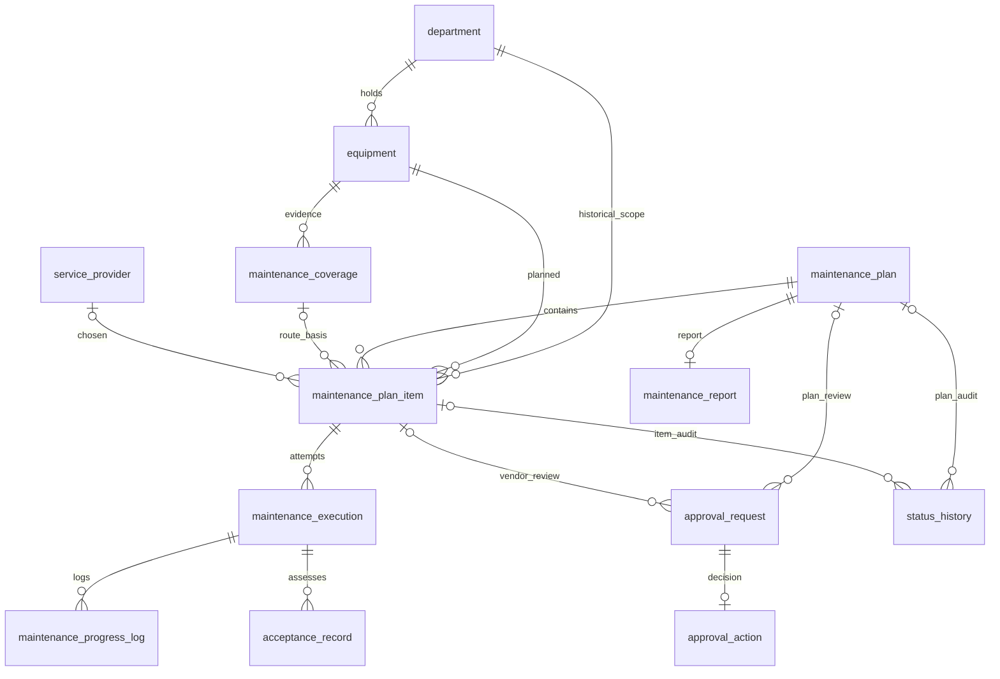
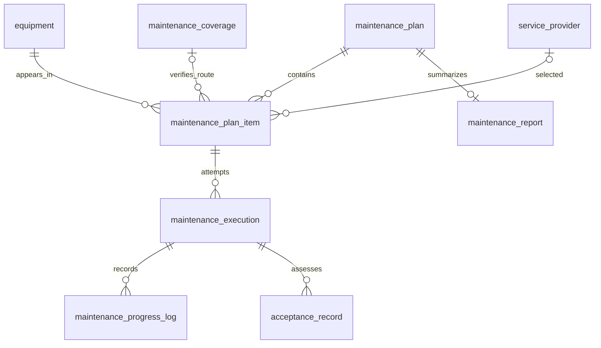
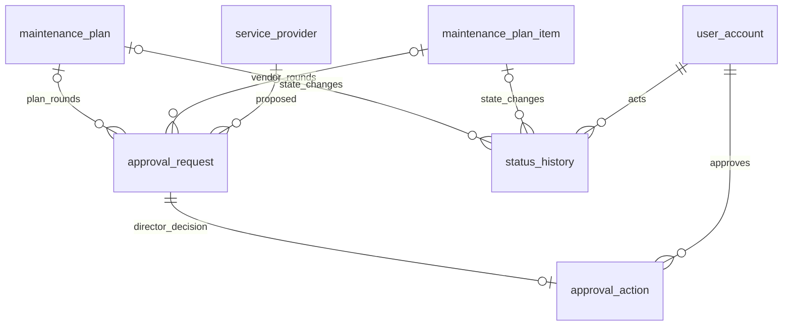

# Database Slide Source — Frozen V1

**Authority:** `reports/phase_1_1_database_design_freeze_report.md` and the final files named in `database_design/README.md`. These eight slides use the **14-table/31-FK/117-column** freeze. Diagrams below are simplified presentation views; `database_design/erd.md` contains all 31 FKs. No diagram implies a running database.

# Slide 1 — Database Design Approach

## Main message
We derived the smallest V1 data model from use cases, state rules and forms.

## Content
- SA V1 defines UC01–UC12, BR01–BR05 and two lifecycles.
- Hospital forms supply terminology and fields.
- Every table has a cited reason to exist.
- V1 covers maintenance; repair is a hand-off only.
- Freeze status: PASS for the documented university V1.

## Visual
Use the process chain “Forms/SA → UC/BR → data requirements → 14 tables → constraints/ERD” from freeze report ``3/22` as a simple horizontal flow.

## Speaker notes
The model was not copied from the paper forms. BM01 is a schedule grid, BM02 is a provider request, and BM06/BM08 are acceptance and handover examples. The System Analysis gives the software behavior, while forms show the data hospital staff recognize. We traced the workflow through requirements and use cases to entities, keys and constraints. The design deliberately stops at V1 maintenance. When damage calls for repair, the item records REPAIR_REQUIRED and keeps its history; the repair process belongs to V2. The goal of this review was a model a student team can explain and implement, with every table connected to an actual requirement.

## Source
`database_design/source_analysis.md`; `database_design/database_traceability_matrix.md`; freeze report ``2–3, 22`.

# Slide 2 — From Forms to Data Model

## Main message
A single paper form can contain several normalized business concepts.

## Content
- BM01 → plan period, departments, individual planned equipment.
- BM02 → coverage evidence, vendor request, director decision.
- BM03 → one narrative report; counts derived from item states.
- BM06/BM08 → technical and handover results with known signers.
- No one-form-one-table copy.

## Visual
Use freeze report `10 table “Business Forms → Final Tables”; keep only BM01, BM02, BM03, BM06/BM08 rows.

## Speaker notes
BM01 lays months, weeks and departments out as a grid; the database stores a plan and multiple device items instead. BM02 combines a statement about non-free maintenance, a proposed external partner and the director’s response. Those are different facts: coverage, request and decision. BM03 provides narrative report sections, so we store the narrative and calculate equipment counts from current item outcomes. BM06 and BM08 supply conclusion and handover terms, but they are broader forms, not exact electronic screens. This decomposition prevents duplicated department and provider text and allows UC12 to retrieve a device’s history across multiple campaigns.

## Source
`database_design/source_analysis.md` `3; freeze report `10; `database_design/normalization.md`.

# Slide 3 — Final Entity Groups

## Main message
Fourteen tables fall into four small, explainable groups.

## Content
- Master Data: department, user_account, equipment, service_provider.
- Maintenance Workflow: coverage, plan, item, execution, log, acceptance.
- Approval/Audit: request, action, status_history.
- Reporting: maintenance_report.
- Six unnecessary Phase 1.1 tables are absent.

## Visual
Use freeze report `6 four-row architecture table, with group counts 4 / 6 / 3 / 1.

## Speaker notes
Master data identifies people, units, devices and partner organizations. The maintenance workflow keeps evidence about coverage, a campaign, each device in that campaign, work attempts, repeated notes and acceptance. Approval and audit hold the director’s decisions and state transitions separately. One report completes the campaign. This grouping helps us defend each table: the plan and item own distinct state machines; execution is needed for rework; logs are repeated; approval action is a different event from a request. We removed the role junction, standalone vendor proposal, assignment history, arbitrary participant list and optional attachment infrastructure because V1 does not require those separate lifecycles.

## Source
`database_design/erd.md` `2; `database_design/design_freeze_diff.md` ``2–5; freeze report ``5–7`.

# Slide 4 — Final ERD Overview

## Main message
The frozen relationships connect the maintenance path directly, with typed approval and audit references.

## Content
- Fourteen entities; full ERD has 31 FKs.
- Plan 1→N item; equipment recurs across plans.
- Item links current provider and verified coverage.
- Execution records actual provider for each attempt.
- Approval and audit are separate trails.

## Visual
**A. Presentation overview ERD** below. Use the complete `database_design/erd.md` `3 as backup, not the primary 16:9 figure.

## Speaker notes
This is a deliberately simplified overview, so it hides actor and some provider foreign keys while the full ERD documents all 31. Start with the plan and its items: the campaign is approved once per round, but each device progresses independently. An equipment can appear in later campaigns without duplicating its master row. Coverage evidence can be reused for a verified route; a provider is chosen on the item. Each execution then fixes the provider who actually performed that attempt. On the right, a request receives a director action and a plan or item has transition history. These direct links replace several chains in the original model.

## Source
`database_design/erd.md` ``2–3, 6; freeze report ``8, 11`.

# Slide 5 — Core Maintenance Workflow

## Main message
One device can be reworked without losing its earlier work or acceptance result.

## Content
- PlanItem is the device’s campaign record.
- Provider route must be valid before work starts.
- Each Execution is a numbered attempt.
- ProgressLog stores repeated notes; AcceptanceRecord stores each typed result.
- Failed acceptance leads to another attempt or a V2 hand-off.

## Visual
**B. Core workflow ERD** below; also in `database_design/erd.md` `4.

## Speaker notes
The item is not the same as the equipment master: it is a device participating in one particular campaign. Before UC08 starts work, the plan must be approved and the item must have an allowed route and provider. Execution captures one actual work attempt, including the provider used. Several progress logs can describe work and damage within it. Technical acceptance and department handover are separate types of assessment. A failed result is retained, then REWORK_REQUIRED leads to another numbered execution, preserving the old attempt. If damage exceeds maintenance scope, REPAIR_REQUIRED ends V1 maintenance and remains reportable as a hand-off, never as completed work.

## Source
`database_design/logical_data_model.md`; `database_design/erd.md` `4; freeze report ``15–17`.

# Slide 6 — State, Approval and Audit

## Main message
Current status, director decisions and state history serve different purposes.

## Content
- Plan has 8 states; item has 11.
- A new request records every resubmission round.
- ApprovalAction stores one BGĐ decision per request.
- StatusHistory records every plan/item transition.
- State, decision and audit commit together.

## Visual
**C. Approval/audit ERD** below; show the plan/item status lists alongside it as two small text callouts.

## Speaker notes
A plan request and a vendor request share a simple approval table, with exactly one subject. The vendor request holds the proposed provider and rationale, so the separate proposal table is unnecessary. The director’s action remains separate because the request exists before the decision, and resubmission produces another request/action pair. Current statuses live on the plan and item for fast checks. StatusHistory records what changed, when and by whom; it cannot replace current status. The plan’s eight values and item’s eleven values have different transition graphs. The backend applies those graphs and commits the new state, approval action and audit row in one transaction.

## Source
`database_design/erd.md` `5; `database_design/data_dictionary.md` state vocabularies; freeze report ``13–14, 18`.

# Slide 7 — Normalization, Integrity and NFR

## Main message
The compact model remains normalized and enforces the right rules at the right layer.

## Content
- Repeating devices, work notes and approval rounds use child rows.
- Unknown coverage is not verified non-free.
- PK/FK/UNIQUE/CHECK protect local data integrity.
- Backend enforces role, cross-row guards and state transitions.
- Versions prevent lost updates; audit writes are atomic.

## Visual
Use freeze report ``19–21 as a two-column table: “Database constraints” versus “Backend rules,” with BM01 and coverage examples.

## Speaker notes
The design is approximately 3NF where it matters: department and provider names have masters, coverage has dated records, and a plan’s multiple devices are item rows. Work notes and repeated decisions are separate records rather than overwritten text. We did not add a table merely for arbitrary handover participants because UC10 names the two digital signers we need. PostgreSQL can ensure key integrity, allowed labels and uniqueness, but a CHECK cannot decide whether the plan was approved and an external partner was authorized before work. Those conditions belong in a transactional domain service. Version columns on plan and item detect concurrent edits; the same transaction records every state transition.

## Source
`database_design/normalization.md`; `database_design/database_constraints.md`; `database_design/database_nfr_design.md`; freeze report ``19–21`.

# Slide 8 — Frozen Design and Implementation Readiness

## Main message
The 14-table design is ready for reviewed Phase 1.2 implementation within the documented V1 scope.

## Content
- 20→14 tables, 42→31 FKs, 154→117 columns.
- UC01–UC12 and BR01–BR05 retain storage/enforcement paths.
- Zero schema-level implementation blockers.
- Optional scans and Repair V2 remain out of scope.
- Phase 1.2 follows the frozen contract after human review.

## Visual
Use freeze report `4 before/after table and `26 status; no additional diagram.

## Speaker notes
This freeze removed six tables, eleven foreign keys and thirty-seven columns, with reductions calculated from audited documents. The remaining tables still support all twelve use cases, five business rules, two separate state lifecycles, department isolation, optimistic locking and audit. The source procedure excerpt is incomplete and BM08/BM09 form relevance can be clarified later; the project has explicit V1 policies that avoid schema ambiguity. No database or migration was created in this phase. The next step is human review of the freeze report and the Phase 1.2 contract, then implementation exactly from the final dictionary, ERD and constraints. Any new requirement that would change schema must trigger a reviewed amendment.

## Source
`database_design/design_freeze_diff.md`; `database_design/phase_1_2_implementation_contract.md`; freeze report ``4, 23–26`.

# Database Viva / Defense Notes — Frozen V1

| # | Likely question | Short, source-grounded answer |
| ---: | --- | --- |
| 1 | Why did you simplify the first design? | Six prior tables supported optional or generic mechanisms rather than mandatory V1 behavior. The freeze keeps UC01–UC12 and BR01–BR05 while reducing 20→14 tables and 42→31 FKs. |
| 2 | Why not reduce below 14? | Plan/item have different lifecycles; request/action are different events; execution/log handle repeated attempts and notes; history is required by BR05. Merging those would lose a required distinction. |
| 3 | Why not one table per paper form? | BM01 repeats schedule entries and BM08 lists equipment/participants. The system needs shared equipment, plans, approvals and history across forms, so normalized business concepts are stored instead. |
| 4 | Why separate MaintenancePlan and MaintenancePlanItem? | SA Part III specifies eight plan states and eleven item states. Devices in one campaign can finish, require rework or hand off to repair independently. |
| 5 | Why keep StatusHistory when status is already stored? | Current status supports guards and lists; BR05/NFR-AUDIT require old/new state, actor, time and reason for each transition. History cannot replace current state, and vice versa. |
| 6 | Why does absent coverage not mean NOT_FREE? | UC05 explicitly forbids the inference. A missing row or UNKNOWN blocks routing until VTYT verifies FREE or NOT_FREE with evidence. |
| 7 | Why merge VendorProposal into ApprovalRequest? | UC06 draft, submission and revision are approval-round stages. The proposed provider/rationale are only needed for that round; a new request preserves each resubmission. |
| 8 | Why keep ApprovalAction separate? | A request exists while pending; BGĐ acts later. A distinct immutable action preserves who decided what and prevents overwriting prior rounds. |
| 9 | Why remove MaintenanceAssignment? | The item stores current provider/route; execution stores the actual provider per attempt. Approved vendor requests and verified coverage explain authorization, so separate assignment history adds no required V1 fact. |
| 10 | Why keep MaintenanceExecution? | REWORK_REQUIRED loops to fieldwork. A numbered execution per attempt prevents earlier start/end/provider and failed assessment from being overwritten; logs hold multiple notes inside each attempt. |
| 11 | Why remove AcceptanceParticipant? | UC10 requires the department and VTYT to confirm. Their IDs/times are explicit on the typed acceptance row; arbitrary additional paper witnesses are not structured V1 requirements. |
| 12 | How is 3NF applied without over-decomposition? | Equipment references department; provider details live in one master; plan items are separate repeating rows; request and decision are separate temporal facts. Only the historical department FK is retained where scope would otherwise change. |
| 13 | Which BRs are enforced in backend rather than CHECK? | BR02–BR04 depend on approval, coverage, actor and acceptance rows plus transition order. The backend validates them transactionally; the DB enforces local PK/FK/UNIQUE/CHECK rules. |
| 14 | How do UC12 and concurrency work? | UC12 follows equipment→plan items→executions/logs/acceptances and related report/history. Version columns on plan/item reject stale writes under NFR-REL-02. |
| 15 | Why no Repair V2 table or attachment table? | REPAIR_REQUIRED keeps the maintenance item/log/audit as a hand-off, while repair itself is outside V1. UC09 makes scans optional, so upload infrastructure is deferred; neither mandatory workflow requires a new table. |

**Status:** PASS for the documented university V1 design freeze. Hospital-specific form/legal policy questions are recorded separately and must be revisited if the project scope changes.

